# YaAC Brick Documentation

This document describes all brick types in YaAC (Yet another Arcanoid Clone), their indices, and the actions triggered when hit.

## Overview

- **Brick Index Range**: 12-61
- **Destructible Bricks**: 12-53 (must be cleared to complete a level)
- **Solid/Indestructible Bricks**: 54-61 (cannot be destroyed, don't count toward level completion)

## Brick Types

### Simple Bricks (Index 12)

| Index | Image | Name | Score | Description |
|-------|-------|------|-------|-------------|
| 12 | 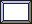 | Simple Stone | 25 | Basic brick, destroyed on first hit |

### Multi-Hit Bricks (Index 13-16)

| Index | Image | Name | Score | Description |
|-------|-------|------|-------|-------------|
| 13 | 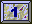 | Hit 1 | 50 | Needs 1 more hit to become simple stone |
| 14 | 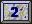 | Hit 2 | 50 | Needs 2 more hits |
| 15 | 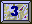 | Hit 3 | 50 | Needs 3 more hits |
| 16 | 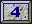 | Hit 4 | 50 | Needs 4 more hits |

### Gravity Bricks (Index 17-21)

| Index | Image | Name | Score | Description |
|-------|-------|------|-------|-------------|
| 17 |  | Zero Gravity | 125 | Turns off gravity |
| 18 | 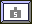 | 5G | 75 | Light gravity (like Mars) |
| 19 |  | 10G | 125 | Normal gravity (Earth) |
| 20 | 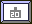 | 20G | 150 | High gravity |
| 21 | 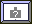 | Queer Gravity | 250 | Random changing gravity in intensity and direction |

### Score Multiplier Bricks (Index 22-25)

| Index | Image | Name | Score | Description |
|-------|-------|------|-------|-------------|
| 22 | 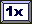 | Times 1 | 25 | Reset to single score |
| 23 | 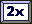 | Times 2 | 25 | Double all points |
| 24 | 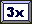 | Times 3 | 25 | Triple all points |
| 25 | 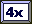 | Times 4 | 25 | Quadruple all points |

### Paddle Effect Bricks (Index 26-28)

| Index | Image | Name | Score | Description |
|-------|-------|------|-------|-------------|
| 26 | 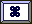 | Apple | 300 | Shrinks paddle (temporary) |
| 27 |  | Sun | 200 | Spawns a deadly skull enemy |
| 28 | 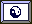 | Yin Yang | 225 | Enlarges paddle |

### Ball Size Bricks (Index 29-31)

| Index | Image | Name | Score | Description |
|-------|-------|------|-------|-------------|
| 29 | 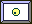 | Small Ball | 25 | Changes ball to small size |
| 30 | 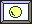 | Medium Ball | 25 | Changes ball to medium size |
| 31 | 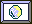 | Big Ball | 25 | Changes ball to large size |

### Enemy Spawn Bricks (Index 32)

| Index | Image | Name | Score | Description |
|-------|-------|------|-------|-------------|
| 32 | 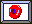 | Donut/Rotor | 75 | Spawns a bouncing rotor enemy |

### Ball Count Bricks (Index 33-35)

| Index | Image | Name | Score | Description |
|-------|-------|------|-------|-------------|
| 33 | 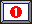 | Red 1 | 100 | Reduces to 1 ball in play |
| 34 | 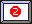 | Red 2 | 100 | Changes to 2 balls in play |
| 35 | 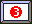 | Red 3 | 100 | Changes to 3 balls in play |

### Hazard Bricks (Index 36-38)

| Index | Image | Name | Score | Description |
|-------|-------|------|-------|-------------|
| 36 | 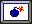 | Bomb | 100 | Explodes, spawns deadly fragments |
| 37 | 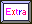 | Extra Ball | +1 Ball | Gives an extra ball (life) |
| 38 | 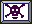 | Killer | 90 | **Deadly** - Touching with paddle kills you |

### Direction Bricks (Index 39-44)

| Index | Image | Name | Score | Description |
|-------|-------|------|-------|-------------|
| 39 |  | Down | 125 | Accelerates ball downward |
| 40 | 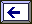 | Left | 125 | Accelerates ball leftward |
| 41 |  | Right | 125 | Accelerates ball rightward |
| 42 | 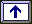 | Up | 125 | Accelerates ball upward |
| 43 | | Up-Right | 125 | Accelerates ball up and right |
| 44 | | Up-Left | 125 | Accelerates ball up and left |

### Special Bricks (Index 45-52)

| Index | Image | Name | Score | Description |
|-------|-------|------|-------|-------------|
| 45 | 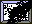 | Teleport | 150 | Teleports ball to another random teleport brick |
| 46 |  | Smily/Level Up | 300 | Advances to next level |
| 47 | 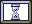 | Hourglass/Slow | 30 | Slows down ball and mouse |
| 48 |  | Phone | 40 | Randomizes ball velocity |
| 49 | 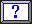 | Question | Random | Transforms into a random brick type |
| 50 | 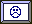 | Level Down | - | Returns to previous level |
| 51 | 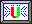 | Magnet (Enabled) | - | Active magnet - attracts ball |
| 52 |  | Magnet (Disabled) | - | Inactive magnet - becomes active when enabled one is destroyed |

### Paddle-Destroyable Brick (Index 53)

| Index | Image | Name | Score | Description |
|-------|-------|------|-------|-------------|
| 53 | 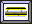 | Bat | 250 (paddle) | Cannot be destroyed by ball, only by paddle |

### Solid/Indestructible Bricks (Index 54-61)

These bricks cannot be destroyed and don't count toward level completion.

| Index | Image | Name | Description |
|-------|-------|------|-------------|
| 54 | 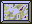 | Solid | Indestructible, ball bounces off |
| 55 | | Solid Die | **Deadly** - Kills paddle on contact |
| 56 | | Solid Down | Solid + accelerates ball downward on bottom hit |
| 57 | | Solid Left | Solid + accelerates ball leftward |
| 58 | | Solid Right | Solid + accelerates ball rightward |
| 59 | | Solid Up | Solid + accelerates ball upward on top hit |
| 60 | | Solid Up-Left | Solid + accelerates ball up and left |
| 61 | | Solid Up-Right | Solid + accelerates ball up and right |

## Special Mechanics

### Gravity System
The gravity setting is stored at map position (0,0):
- Index 3: Zero G
- Index 4: 5G (light)
- Index 5: 10G (normal)
- Index 6: 20G (heavy)
- Index 7: Queer G (random)

### Score Multiplier System
The multiplier setting is stored at map position (1,0):
- Index 8: 2x multiplier
- Index 9: 3x multiplier
- Index 10: 4x multiplier

### Magnet System
- Only one magnet can be active at a time
- When an enabled magnet (51) is destroyed, a random disabled magnet (52) becomes enabled
- The magnet creates a force field that attracts the ball

### LIFE Levels
Some levels use Conway's Game of Life algorithm (2-3-3 variant):
- Bricks in rows/columns 0 and 19 don't die at generation change
- Generation stones in columns 3, 4, 5 of row 0 determine respawning brick types
- Ball/paddle starting position determines if LIFE mode is active

## Additional Images

| Image | Description |
|-------|-------------|
|  | Standard ball |
| 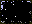 | Invisible brick (proposed) |
| 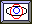 | Rubber brick (proposed) |
| 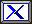 | Index indicator |

## Sound Effects

Each brick type triggers a specific sound when hit:
- Sound 2: Solid bricks
- Sound 3: Simple bricks, magnet bricks
- Sound 4: Wall collision
- Sound 6: Gravity bricks
- Sound 8: Apple
- Sound 9: Donut
- Sound 10: Bat brick
- Sound 11: Killer
- Sound 12: Score multiplier
- Sound 14: Extra ball
- Sound 15: Direction bricks
- Sound 18: Paddle killed by solid die/killer
- Sound 19: Bomb
- Sound 20: Enemy spawn (skull/rotor) - loops
- Sound 21: Ball size change
- Sound 22: Ball lost / Level change
- Sound 25: Red bricks (ball count)
- Sound 26: Phone
- Sound 29: Multi-hit bricks
- Sound 32: Teleport
- Sound 33: Smily (Level Up)

---

*Generated from StoneEvents.pas and b0l01.pas analysis*
