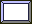
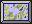
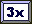
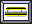
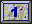
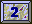
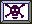
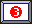
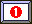
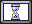

# yaac

A Delphi Games Creator breakoutstyle game with full source and a level editor.
The zip-file contains the game, source, level editor and a bit of documentation.
It does add some new features to the genre, like gravity and a 4 directional paddle.
77 Levels included.

This is a very old game of mine, which I always wanted to convert to  a modern framework.
Before it vanishes I thought it would be a good idea to move it to github.

It is known to work on Microsoft Windows up to 2000 and IIRC it compiles
with Delphi 3 and Delphi 4 (I did mention it is a VERY old game didn't I)
I also got it running with some issues on Ubuntu 22.04 with Wine but ymmv.

As DGC is required and in the past years I almost thought this was lost too and just found it again I included a copy here.
Unluckily the version required DGC beta 7.1 which includes the mapeditor component seems to be lost in time.
---

## YaAC - Yet another Arcanoid clone (Full Documentation)

## About the Game

YaAC - Yet another Arcanoid Clone - is a Breakout/Arcanoid style game. All you got to do is to hit the bricks with the ball. When you destroyed all the bricks a level is finished. You move your paddle with the mouse. The stronger you hit the ball the higher is the acceleration. Real simple, so get going.

Tom Wilson of [turbo](http://turbo.gamedev.net/) wrote about YaAC:

> *DGC Breaks Out....*
>
> *Christian Ledermann send in a Delphi Games Creator breakout style game with full source AND a level editor. The ZIP File contains the game, source, level editor and a bit of german documentation. Christian does add a few features to the genre, like gravity and a 4 directional paddle. It's a great example of a hobbyist programmer expanding a style.*

The game runs in 640x480 resolution, the stones are arranged in a 20x20 grid.
Each stone is 32x24 pixels.

## License

This program is free software; you can redistribute it and/or modify it under the terms of the [GNU General Public License](GPL.html) as published by the Free Software Foundation; either version 2 of the License, or (at your option) any later version.

To recompile YaAC you will need Delphi 3 (or higher) and the [DGC](http://info.ex.ac.uk/~PMBearne/DGC.html) components. Direct input is handled in the unit [DirectInputAS](http://www.delphi-jedi.org/DelphiGraphics/DirectX/DISimple.zip) which you will find on [Delphi-Jedi](http://www.delphi-jedi.org/) in the DISimple Demo of Arne Schäpers.

The backgrounds were designed with [Harm's sTile](https://harmware.net/stile.html).

## Download

- **[YaAC 1.0](Yaac10.zip)** - The Game itself
- **[YaAC Leveleditor](mapedit.zip)** - You will need that one if you want to create your own levels. The Editor is still in an (early) beta stage but I think it is OK for a start.

## Installation

Just copy the files YAAC.EXE and YAAC.HCL into a directory of your choice. That's all, no further setup needed.

## System Requirements

In order to play YaAC you will need a more or less up to date hard and software. Minimum is a Pentium 166 a Video Card that can display 640 * 480 in HiColor (16 bit), a direct sound compatible soundcard and a mouse. It runs with Window 9X with DirectX 6.1 or later. (I did not test it but I assume it will run on Windows ME and Win 2000)

## Controls

You operate the paddle with your mouse (any questions?).

Press:

- **"N"** to start a **n**ew game
- **"S"** to **s**ave the current game (well actually only your score and the number of the level you are in, but not the state of the current level)
- **"L"** to load a previous saved game
- **"P"** to pause the game
- **"Z"** to show the HiScores
- **"ESC"** to end the game

There are **C**heats of course but you will have to find them yourself (have a look at the code).

## Status Display

- **Ball icon** - the number of balls left are displayed on the lower edge of the screen
- **G10 icon** - In the left upper corner of the screen the current G-force is displayed
- **4x icon** - If you are lucky all your points will score 2, 3, or 4 times the value of the bricks
- Your score and the number of the current level is displayed

## The Bricks

Every kind of brick has its own features. Some of them are massive and cannot be destroyed, others break at first contact, and some of them you have to hit several times in order to get rid of them. Bricks may cause actions such as switching on or of the g-force, accelerating or decelerating the ball or giving you a bigger paddle. Some Bricks may not be destroyed by the ball but with your paddle other bricks will destroy your paddle when you touch them. Magnetic bricks will have an (fatal???) attraction to your ball, teleporter will beam your ball to another place.

In a few of the Levels your bricks will get alive, so that every 0.7 seconds you will have to deal with the next generation of bricks (based on the LIFE 2-3-3 algorithm).

### Brick Types

| Brick Image | Description |
|-------------|-------------|
|  | A simple stone. It only has to be hit once. |
|  | Solid stone. You cannot destroy it. |
|  | turns off the G-force |
|  | turns a moderate g-force on (like on mars). |
|  | Normal G-force (for an earthling ;-)) |
|  | high G-force |
|  | single score only |
|  | From this time forward all your points score double |
|  | ..three times |
|  | .. four times. |
|  | The g-force will change in intensity and direction from time to time. |
|  | Your paddle shrinks, but do not worry it will grow again . |
|  | You cannot destroy this Stone with the ball, but with your paddle. |
|  | if you ever need &nbsp;a big |
|  | medium |
|  | or a small ball.... |
|  | This stone will explode, watch out for the remains |
|  | A small rotor appears witch will put an end to your paddle if you happen to touch it |
|  | down we go |
|  | sometimes you just need an extra-ball |
|  | 1 hit left then this stone will turn out to be an simple stone |
|  | 2 hits left |
|  | 3... |
|  | Please do not touch |
|  | The last level was not so bad, was it? Destroying this stone will get you back there. |
|  | Next level, up we go. |
|  | a bit of acceleration to the left. |
|  | This magnet is not yet active |
|  | but this one surely is. |
|  | Do you get nervous when the phone rings? |
|  | You can never be sure what this stone turns out to be or how much points you get destroying it. |
|  | Three Balls may be more than you can handle at a time |
|  | No matter the number of Balls in play before, after you hit that one only one is left |
|  | Deceleration |
|  | Here comes the Sun, and a skull |
|  | Ooops where is it? the Ball gets teleported to a randomly chosen teleport brick. |
|  | Your paddle grows. |

## Known Bugs and Issues

I am sure that there still are a few. If you catch one drop me an [e-mail](mailto:christian.ledermann@gmail.com)!

Tabbing away to another application will sometimes crash the game (fortunately not the system). If you have problems with your taskbar try leftclicking the mouse or change the properties of your taskbar. If you do not have a soundcard, YaAC will crash :-(((.

## Building Your Own Levels

Like every other good game YaAC comes with an leveleditor, that enables you to create your own levels, or modify existing Levels.

Levels above level 26 are meant to be modified. Have a look at all the levels and do not make your own levels to complicated or to easy.

Just start YaACMapEdtor and get going.

### A Short Introduction to the LevelEditor

The level editor is optimized (i.e. you do not need to load the graphic library) to work with YaAC Levels but you may use it for any kind of map you created with the DGC MAP EDITOR.

*Features written in italics are not yet implemented*

#### Icons

##### Main Bar

Most of the icons should be self explanatory. The Main Icon bar contains 4 icons. These icons are used to create a new library, open an existing library, save the current library, and load in an Image Library to use as tiles.

You can use the scroll bars to move around if you wish.

The Clear Map icon allows you to clean a map. This action will use the currently selected tile as the clearing tile.

The Map Properties Icon will allow you to change the basic properties of the current map. You can rename a map with this option.

The Remap Tile icon will allow you to change all references to a tile to another tile.

The Transparency Icon (toggle) will allow you to view the map over a background color so that you can get a rough idea on what the map will look like when drawn in the game.

The Grid Lines Icon (toggle) will turn on/off grid lines. This may make it easier for you when drawing your maps, especially with smaller tiles.

The Color Block allows you to change the Transparent color used for viewing in transparency mode.

The Zoom Percentage selector allows you to view/edit your map at different levels of zoom. 100% is normal. You can select a lower amount to fit more of the map on the screen or a higher value if you need to look at the map up close.

##### Tile Bar

On top of the tile bar is a single tile display which shows the currently selected tile. You can select a tile to draw with by clicking on it in the tile bar.

Note: While working on a map, you can click the right mouse button on a tile in your map to switch to that tile saving you a small amount of time.

##### Library Bar

*The Library Bar has four Icons. The first Icon is used to add a new map to the library. The second is used to delete a map from the library. You can arrange the order of the maps by using the last two icons.*

##### Status Bar

The Status Bar shows some basic details about the map you are working on. In the first pane, you will see the name of the map library that you are working on. The second pane is the map index that you are working on. The third pane displays the size of the map. The fourth pane shows the current cursor position on the map and the fifth pane shows the current tile under the cursor.

##### Menu Items

Most of the menu items have a corresponding Icon.

### Level Design Rules

Please be sure you follow these basic rules when designing a new Level:

- Please do not modify the first level (Index 0), It is used internally as a startupscreen
- The first and the last rows of each level are used for the display of status information etc. I recommend not to alter these rows unless you know what you are doing

The contents of the first row is:

1. G-Force
2. Multiplikator
3. 1. LIFE-Stone
4. 2. LIFE-Stone
5. 3. LIFE-Stone
6. High-Score
7. Level

The last row displays the balls you have left. Any tile you place here will be overwritten.

There can be only one active magnet per level. When it is destroyed the next magnet gets active.

In each level you have to define a starting point for your ball and your paddle. If you do not define these point you will get a LIFE Level (and I do mean that, The algorithm it is based on is the good old Life 2-3-3)

If you want to design a LIFE-Level be aware of the following: The bricks in the rows, columns 0 and 19 will not die at a generation Change regardless how many other bricks are around them. In the Columns 3, 4 and 5 of the uppermost row (0) you may place the tiles that determine the kind of respawning bricks. No tile means that a simple brick will appear.

Backgrounds and animations are stored in the YaAC.HCL - DGC HI-COLOR IMAGE LIBRARY. To change them you will need the DGC HI-COLOR IMAGE LIBRARY EDITOR. If you want a starfield instead of a static background just change the image of the according level into a 1 by 1 pixel image (the index for the background is currently 36 + Level)

If you design a level that you think is real cool send it to me. I will include it in the next release of YaAC.

## To Do

I still think of YaAC as a BETA Release, but meanwhile at least most of the bugs are fixed and it runs stable on almost every machine that meets the system requirements. Leveldesign is still a major issue but that's what the level editor is for.

### Animations and Graphics

I do think I am better at programming than at graphic design. So if you have ideas how i could make YaAC look better, or some animations you would like to add to YaAC please do not hesitate to contact me.

### Sounds

I did not yet do any kind of real sound design or implemented background music (the DGCMidi Component is not yet working with Delphi 3 any suggestions?). I thought about adjusting the sounds to the speed of the ball (the higher the velocity of the ball the louder the sound when it hits a brick) or giving the sound a stereo effect depending on where the sound originates.

### New Bricks

There are some ideas for new kinds of bricks already:

- Invisible Bricks
- Bricks that set other bricks on fire while they burn
- undestroyable magnets and teleporters
- a rubberband Brick, that accelerates the Ball the more the further it gets away from the brick
- a brick that toggles the direction of the paddle
- a brick that will accelerate your mouse moves
- wind bricks, with a force field in a specific direction thus blowing the ball away from them
- a brick that blocks the Ball but not the paddle
- bricks that kill the Ball

### Force-Feedback

As soon as I get a new computer or at least a Forcefeedback joystick I think this will be a major issue for future releases.

### Level

And of course more and more refined levels. A Map Library can store up to 255 Levels....

So there are a lot of ideas for future releases. Please give me a [feedback](mailto:christian.ledermann@gmail.com) what you think about my little game, what sucks and what features you want to have implemented in future versions, or implement a version of your own ;-)

to be continued....

---

*[Christian Ledermann](mailto:christian.ledermann@gmail.com) December 2000*
